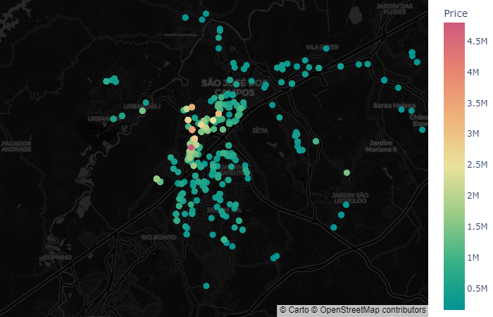

# housing-data-insights
This repository consists in a data science project with the purpose of studying the housing market of my hometown using PCA (Principal Components Analysis). It will cover the data scraping, cleaning and the analysis of our dataset.

## Disclaimer
This repository is part of a larger project where I document my path through my [MBA in Data Science and Analytics](https://github.com/marcuszucareli/MBA). Fell free to check!

## Rationale
PCA is an unsupervised machine learning technique to reduce the dimensionality of a dataset. Understanding this technique is important for data scientists as it allows them to simplify their models, reducing time and computational resource usage, and thus, costs.

PCA can also be used to aid data visualization, even though interpreting the axes might become complex.

To apply the knowledge acquired during the classes, I chose to implement PCA manually, compare it to the results from the scikit-learn library, and write my conclusions based on the comparison.

The subject of the PCA analysis is the housing market in my hometown. The objectives of the analysis can be found in the next section.

## Study Goals
- Implement a PCA analysis using Python to apply what was studied in my classes.
- Understand the concepts of PCA by manually implementing it.
- Interpret the PCA outputs to generate insights about the housing market in my hometown. Also, identify lacks in our model.
- Start working with scikit-learn, a fundamental tool for data scientists.
- Practice the following tools:
    - Python
    - Scikit-learning | machine learning
    - Pandas, Numpy | data analysis/manipulation
    - BeautifulSoup, Selenium  | data scraping
    - Plotly | data visualization
    - Git, Github, pip | version control tools
    - API

## Script Goals
- Perform and compare outputs of manually and library-based PCA analysis.
- Visualize results in a friendly way.
- Make use of API's to get additional data 

## Project Files Overview

### [scrap.py](./scrap.py)

- Scrap a housing market website using beautiful soup and selenium to obtain the variables for our PCA.  
Scraped variables:
    - neighborhood
    - city
    - street
    - description
    - area
    - rooms
    - parking
    - bathrooms
    - price
    - url

- Save the scraped data to [*apartments_data_scraped.csv*](apartments_data_scraped.csv) file.

### [nominatim.py](./nominatim.py)
This file contains a function that uses the [nominatim API](https://nominatim.org/release-docs/develop/api/Overview/) to get the coordinates of the streets of each apartment.

The result is saved into the [*apartments_data.csv*](/apartments_data.csv) file.

### [data_cleaning Notebook](./data_cleaning.ipynb)
This notebook contains the process used for cleaning the data before PCA. The cleaning included:
- Selection of the numerical columns for the PCA
- Evaluation of missing data
- Analysis of the amount of data remaining after the cleaning 

### [data_analysis Notebook](./data_analysis.ipynb)
Notebook with the implementation of PCA, and data analysis of the outputs.

## Study Overview

### Method Comparison
After performing PCA manually and using a library, we observed that the results were identical, but with opposite orientations. The objective of reproducing the PCA manually worked fine.

|    |   PC1_step |   PC1_practical |   PC2_step |   PC2_practical |
|---:|-----------:|----------------:|-----------:|----------------:|
|  0 |  -2.03656  |        2.03656  |  -0.398911 |        0.398911 |
|  1 |  -0.662305 |        0.662305 |  -0.565805 |        0.565805 |
|  2 |   1.21103  |       -1.21103  |  -0.490603 |        0.490603 |
|  3 |   0.308912 |       -0.308912 |  -0.114974 |        0.114974 |
|  4 |   0.827111 |       -0.827111 |   0.520841 |       -0.520841 |
...

### Pearson Correlation Matrix
The first step in PCA, the Pearson correlation matrix shows us a high correlation between price, area, and bathrooms. Latitude and longitude do not seem to explain price very well.

  

### Eigenvalues
The eigenvalues of the Pearson correlation matrix explain how much variance each principal component represents in the original model. The first two principal components match Kaiser's rule, and therefore we will keep only these in the analysis.

|    |    value |   variance % |   cumulative sum |   cumulative variance % |
|---:|---------:|-------------:|-----------------:|------------------------:|
|  0 | 3.3361   |     47.65    |          3.33    |                 47.65   |
|  1 | 1.5027   |     21.46    |          4.83    |69.12   |
|  2 | 0.8850   |     12.64    |          5.72    |                 81.77   |
|  3 | 0.5434   |      7.76    |          6.26    |                 89.53   |
|  4 | 0.3888   |      5.55    |          6.65    |                 95.08   |
|  5 | 0.2271   |      3.24    |          6.88    |                 98.33   |
|  6 | 0.1166   |      1.66    |          7.00    |                100.00   |

By doing this selection, we kept 69.12% of our original variance.

### Loading plots
The loading plots are a visual aid to understand the correlation between variables and components, as well as between variables themselves. We can see that price, area, bathrooms, and rooms (bedrooms) are closely related to principal component 1 (PC1), while latitude and longitude are related to PC2. We can determine this by looking at how close they are to the circle perimeter and to each axis. Also, the variables with similar angles are highly correlated.

  

### Observations plot
The observations plot are the projections of the original data into PC's axis. In this image they are colored by their prices, to  help us visualize the influence of axis on this variable and confirm our calculations.

  

We can see that the prices are, as expected, very correlated with PC1.

### Critical analysis
One thing that this model shows us is that the correlation between prices and latitude/longitude is not high. This means that the area where the apartment is located doesn’t affect its price very much.

This is a strong statement considering our common knowledge of the housing market, but it might be true for this dataset.

To visually confirm this statement, I plotted the location of the apartments on a map, colored by price and also by price/m².

  
  

As we can see in the first image, the areas where prices are higher appear to be outliers. However, in the second chart, it seems that there is a location where apartments are more likely to be more expensive.

The second chart uses data from a variable created using other variables, a strategy that I only considered at the end of this analysis.

The manipulation of our own data to generate additional variables for the study should be done at the beginning of the analysis. Maybe, with price/m², latitude and longitude would be more highly correlated with price.

In a small, student-like model, this mistake might be insignificant, but in a large data scenario, it could delay the analysis or lead to rework.

## Conclusions
- In this data set, apartment's prices were highly correlated with area, number of bathrooms and rooms
- Our variables can be used to generate another variables that might be useful for a machine learning model.
- Scikit-learn is a strong tool that avoids a lot of extra work.
- Understand the conepts of PCA before just applying it helps you understand their outputs much better.

# Requirements
The requirements for running this project are in the file [requirements.txt](./requirements.txt)

# License
This project is licensed under the MIT License. See the LICENSE file for details.

# Author

This project is maintained by [Marcus Zucareli](https://github.com/marcuszucareli).

Connect with me on [LinkedIn](https://www.linkedin.com/in/marcus-zucareli/?locale=en_US)